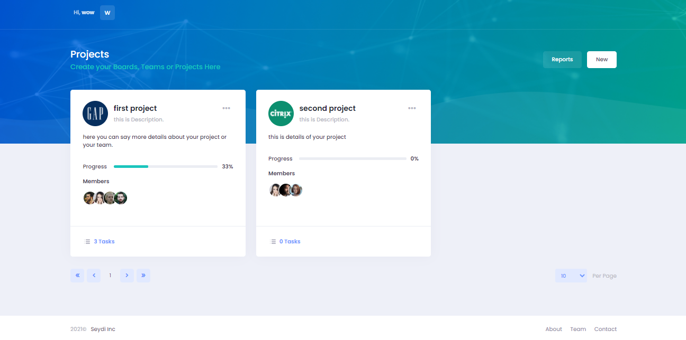
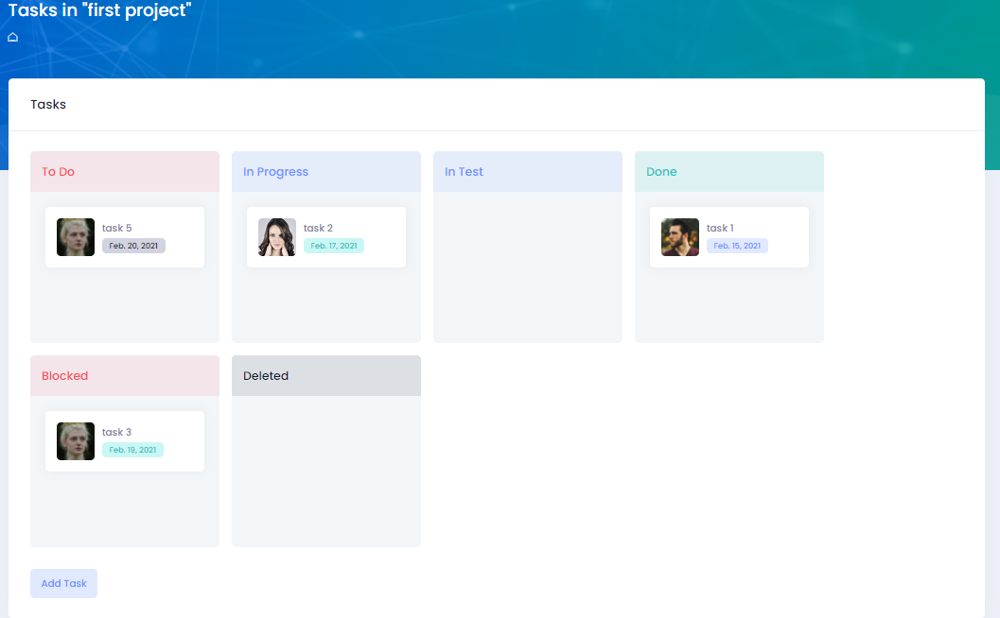
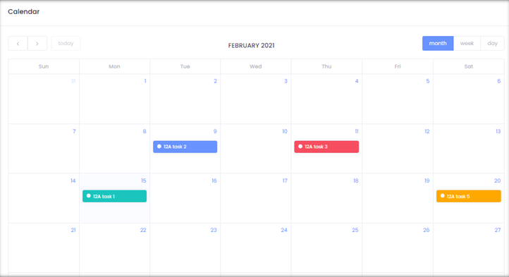
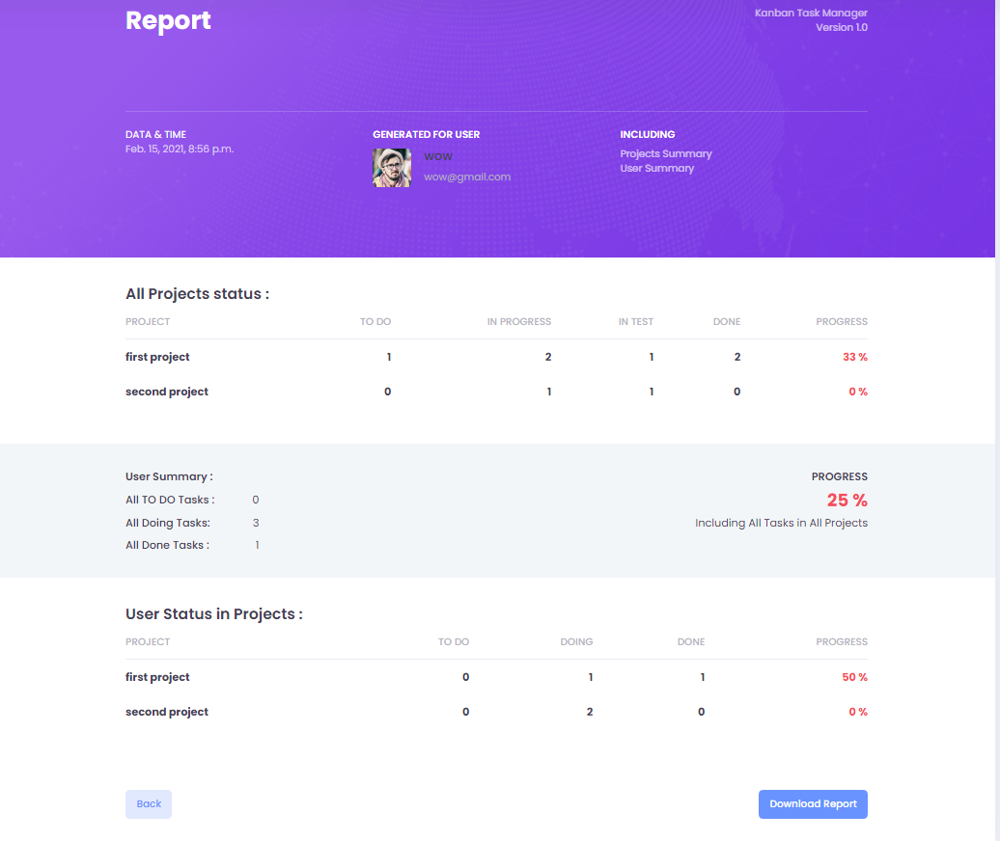

# Oromia finance office , task managiment 
### Manage your teams, projects and tasks

bers.
* The creator user will be the admin of project or team.

### Tasks
* Admin user can add a task and assign it to members and himself. 
* Members can see the start time and end time of a task by clicking on it.
* Members can drag and drop their own tasks to change its status.
* Only admin can add/remove the task to/from "Done", "Blocked" and "Deleted".
* task are assigned based on roles and responsibilties
* also based on confidentiality
  

### Calendar
* Deadline of tasks will be shown in the calendar.
* Only Admin can drag and drop tasks in the calendar to change its deadline.

### Report
* User can see status or all his projects and his status in all projects.

